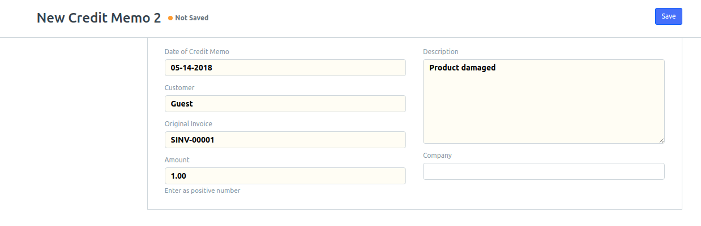

**A Credit Memo application for ERPNext**

ERPNext allows for [Sales Returns](https://erpnext.org/docs/user/manual/en/stock/sales-return) that are redeemed after an invoice has been satisfied. If you want to make a change to the amount owed or offer a credit in future (along the lines of "merchandise credit") you can use this application for that.

Install with:

`bench get-app creditmemo https://github.com/agritheory/creditmemo`
`bench install-app creditmemo`
And as a best practice, but is optional:
`bench update`
`bench migrate`

**Contributors**:
Tyler Matteson (AgriTheory)
Josh Reeder (WHO Agency)

Think this app could be better? Open an issue. Want to make it better? Send a pull request.
Think it should be part of the ERPNext application, let the Frappe team know on the [forum](discuss.erpnext.com).
